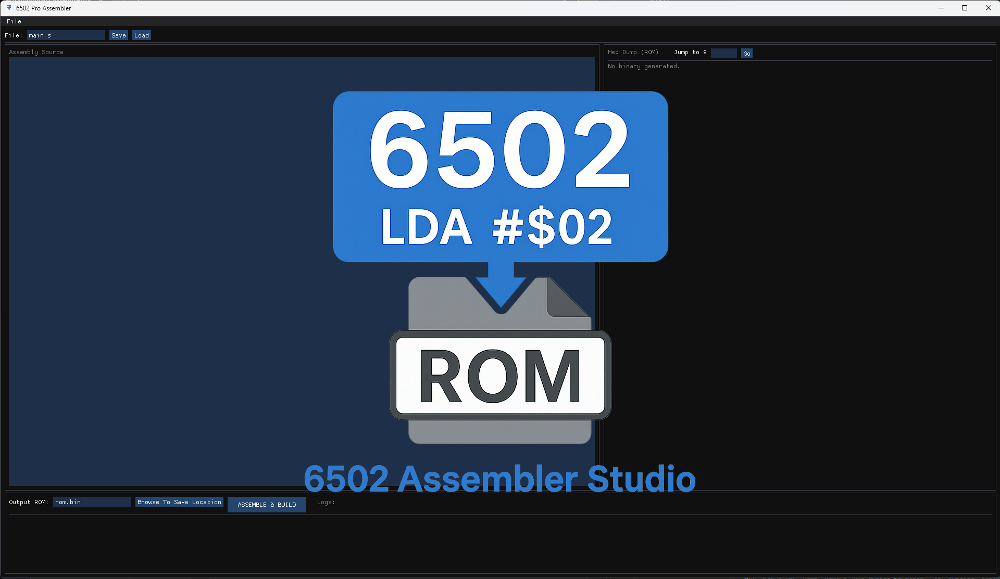
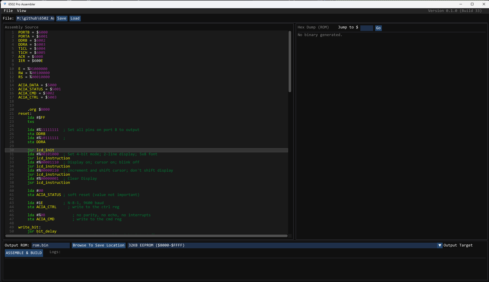
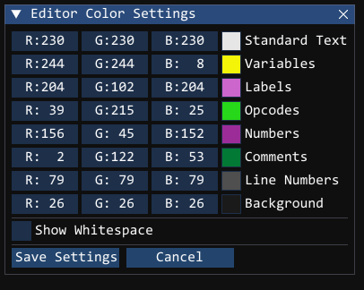

# 6502 Assembler Studio




Welcome to the **6502 Assembler Studio**! I built this project with two main goals in mind: 
1. To deeply understand the inner workings of a two-pass assembler and how raw text is converted into machine code.
2. To create a seamless, integrated tool that generates binary ROM files (`.bin` / `.rom`) that I can plug directly into my custom 6502 emulator for testing.

Whether you are here to write some retro 6502 assembly, test your own emulator, or just explore the code, I hope you find this tool helpful and educational!

---

## Table of Contents
1. [About the Project](#about-the-project)
2. [Features](#features)
3. [Getting Started (Manual Setup & Build)](#getting-started-manual-setup--build)
4. [How to Use the Assembler](#how-to-use-the-assembler)
5. [Project Structure](#project-structure)
6. [Learning Journey](#learning-journey)

---

## About the Project
Writing a compiler from scratch is a fantastic challenge. This assembler reads standard 6502 assembly language (including labels, variables, and mathematical operands), parses it through a custom Lexer, and runs a Two-Pass assembly process to resolve memory addresses and generate valid 6502/65C02 machine code. 

Instead of a simple command-line tool, I wrapped the assembler in a modern, hardware-accelerated Graphical User Interface (GUI) to make writing, building, and inspecting the resulting ROM as frictionless as possible.

## Features
* **Two-Pass Assembly:** Fully supports forward-declared labels, variables (`EQU`), and standard directives (`.ORG`, `.BYTE`, `.WORD`).
* **Modern GUI Engine:** Built using C++, OpenGL, and ImGui for a snappy, responsive developer experience.
* **Integrated Editor:** Write, load, and save your `.s` or `.asm` source files directly inside the application.
* **Live Hex Dump:** Instantly inspect your compiled 64KB ROM visually. Includes a "Jump to Address" feature for quick navigation.
* **Expression Evaluation:** Supports basic bitwise and mathematical operations within your assembly operands.
* **Detailed Build Logging:** Instantly catches syntax errors, unknown mnemonics, or out-of-range branch operations and displays them in the UI.

---

## Getting Started (Manual Setup & Build)

If you are not cloning this repository directly and want to build the project from scratch, follow these instructions. 

### Prerequisites
To compile this project, you will need a C++17 compatible compiler and a build tool like `make`. If you are on Windows, **MSYS2 (MinGW-w64)** is highly recommended.

You will also need the following libraries:
* **GLFW 3:** For window creation and OpenGL context handling.
* **Dear ImGui:** For the user interface (included in `vendor/imgui`).
* **stb_image:** For loading UI assets like splash screens and icons (included in `vendor/stb_image`).

### Directory Setup
Ensure your project folder looks like this:
```
├── assets/             # Contains icon.png, splash.png, etc.
├── libs/               # Contains glfw3.dll (for Windows)
├── src/
│   ├── ui/             # GUI and Window management code
│   └── ...             # Assembler core (.cpp and .h files)
├── vendor/             # ImGui and stb_image files
├── Makefile            # The build script
└── README.md
```
---

### Compiling the Studio
Open your terminal in the project root and run the default build command:

```Bash
make
```

This will automatically:

* 1. **Compile the core assembler and UI files.**

* 2. **Compile the Windows application icon (using windres).**

* 3. **Link the executable and output it to build/release/.**

* 4. **Copy your assets/ and .dll files into the release folder so the app runs perfectly.**

To run the program, navigate to the build/release folder and launch the executable!

---

### How to Use the Assembler






* 1. **Write or Load Code:** Use the top menu bar (File -> Load) to load an existing .s assembly file, or start typing directly into the **Source Editor** pane.

* 2. **Set the Output Location:** In the bottom right pane, click Browse next to the "Output ROM" text box to choose exactly where you want your compiled .bin file to be saved.

* 3. **Assemble:** Click the large ASSEMBLE & BUILD button.

* 4. **Review Output:** 
    * If your code has errors, the Logs window will tell you exactly which line failed.

    * If successful, your binary is instantly saved to your chosen location, and the Hex Dump (ROM) pane will update.

* 5. **Inspect Memory:** Use the "Jump to $" box at the top of the Hex Dump pane to quickly scroll to specific memory addresses (e.g., type FFFC to check your reset vectors).

---

### Project Structure
For those interested in exploring the source code, here is a quick guide to how the application is built:

* src/lexer.cpp & .h: Chops raw assembly text into readable Tokens (Instructions, Operands, Labels).

* src/opcodetable.cpp & .h: The master dictionary mapping 6502 mnemonics (like LDA) to their correct hex byte based on addressing modes.

* src/assembler.cpp & .h: The compiler brain. It runs Pass 1 to map memory, and Pass 2 to generate the final binary array.

* src/ui/mainwindow.cpp & .h: The frontend. Orchestrates OpenGL, ImGui, the file dialogs, and connects the UI buttons to the backend assembler.

---

### Learning Journey
Building this tool was a deep dive into the world of compilers. It has taught me how strict CPUs interpret data, how to manage memory addressing modes, and the complexities of linking C++ libraries cross-platform. It is incredibly rewarding to write a piece of assembly code in a tool I built, compile it into a ROM, and watch my own emulator boot it up successfully! 